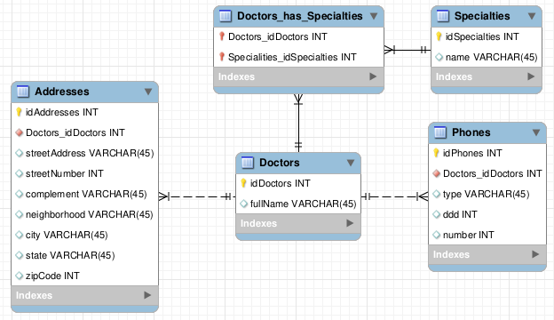

<h1 align="center">
  
  <br />
  Gerenciador de cadastros de médicos
</h1>


## Projeto

Este é um projeto implementa uma API Rest que realiza a gestão de cadastros de médicos.

A API apresenta as seguintes funcionalidades:
<ul>
<li>Permite criar, selecionar, atualizar e deletar registros de médicos.</li>
<li>Permite a busca de médicos por qualquer um dos dados do médico, sendo eles: nome completo, endereço, telefones e especialidades.</li>
</ul>


## Tecnologias

Esse projeto foi desenvolvido utilizando as seguintes tecnologias:

- [NodeJS](https://nodejs.org/en/)
- [MySQL](https://www.mysql.com/)
- [Sequelize](https://sequelize.org/)
- [Jest](https://jestjs.io/)
- [Swagger](https://swagger.io/)
- [Docker](https://www.docker.com/)


## Iniciando

Para iniciar a aplicação é necessário realizar os seguintes passos:

```bash
# Iniciar o projeto
$ git clone https://github.com/mateusleiteaalmeida/node-doctors-registration-manager.git && cd node-doctors-registration-manager

# Iniciar o docker-compose
$ docker-compose up
```


## Documentação

Para acessar a documentação desta API basta iniciar a aplicação e acessar a rota /doc.

Exemplo:

http://localhost:3000/doc


## Banco de dados

A organização das tabelas no banco de dados se estrutura da seguinte forma:

<p align="center">
  
</p>

## Melhorias

É necessário realizar melhorias nos testes.